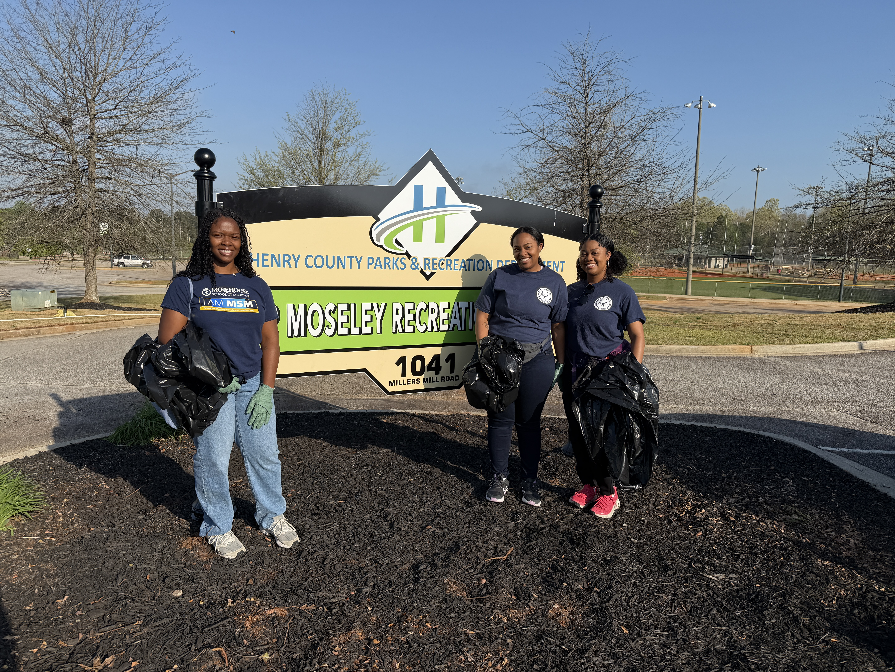

::: {.about-philosophy}

MY PHILOSOPHY

More than a number.
The numbers only matter because the people do.

{.philosophy-flourish fig-alt=""}

:::

::: {.about-story}

::: {.about-story-copy}

ABOUT ME

# The story behind the work. {.about-heading}

My path into public health has never followed a single straight line. With a foundation in chemistry and experiences spanning clinical care, lab research, data, business, marketing and communication, and community health, I have learned to approach health from multiple perspectives. Each experience has strengthened my curiosity about the patterns behind health outcomes—not only what is happening, but why it is happening, who is affected, and where meaningful change can occur.

That curiosity ultimately led me to epidemiology, where I found a way to connect my analytical nature with my commitment to people. I am especially interested in using data to understand disease burden, healthcare access, and the conditions that shape opportunities for prevention. Whether I am analyzing a dataset, developing a visualization, working within a community, or solving an operational problem, I am most energized by work that transforms information into something useful for the people behind the numbers.

:::

::: {.about-story-photo}

{.about-portrait fig-alt="Professional portrait of Kalyn Newton wearing a navy suit and white shirt"}

:::

:::

::: {.about-direction}

PUBLIC HEALTH • PURPOSE • DIRECTION

My work sits at the intersection of epidemiology, chronic disease prevention, healthcare, and community health. As I continue developing as a public health professional and researcher, my goal is to bridge evidence with action—using data to ask better questions, design practical solutions, and contribute to systems of care that strengthen prevention and improve health within communities.

:::

::: {.about-community}

{.about-community-photo fig-alt="Morehouse School of Medicine students participating in the 2026 Day of Service at Moseley Recreation Center"}

*Morehouse School of Medicine 2026 Day of Service at Moseley Recreation Center.*

:::

<a href="#about-bottom"
   class="scroll-cue"
   aria-label="Scroll to the bottom of the About Me page">
  ↓
</a>

