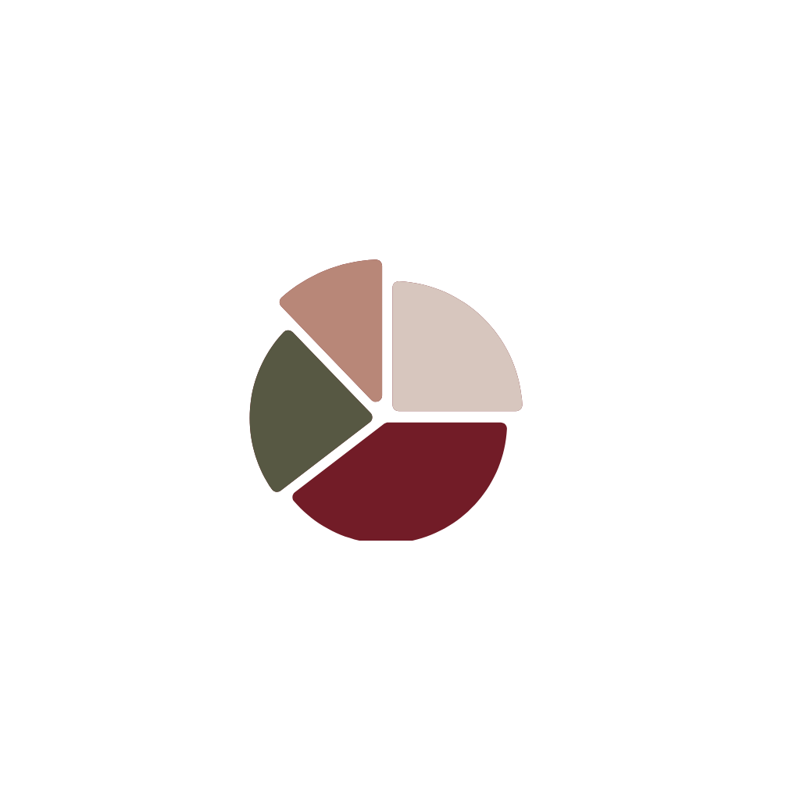

::: {.cv-page}

::: {.cv-hero}

:::: {.cv-hero-grid}

::: {.cv-hero-copy}

CURRICULUM VITAE

<h1 class="cv-title">Experience. Impact. What’s Next.</h1>

A snapshot of my academic journey, professional experience, leadership, and skills.

:::

::: {.cv-download-area}

[↓ &nbsp; Download CV](files/Kalyn%20Newton%20CV.pdf){.cv-download-button}

[↓ &nbsp; Download Resume](files/Kalyn%20Newton%20Resume.pdf){.cv-download-button}

PDF • UPDATED SEPT 2026

:::

::::

:::

::: {.cv-main-layout}

::: {.cv-sidebar}

<nav class="cv-side-nav" aria-label="CV sections">

<a href="#overview">Overview</a>
<a href="#education">Education</a>
<a href="#experience">Experience</a>
<a href="#research-projects">Research & Projects</a>
<a href="#leadership-service">Leadership & Service</a>
<a href="#skills">Skills</a>
<a href="#references">References</a>

</nav>

“Knowledge is a tool, 
but people are the 
purpose.”

:::

::: {.cv-content}

<section id="overview" class="cv-section">

<h2>Overview</h2>

I am a Master of Public Health candidate at Morehouse School of Medicine with experience across community health, research, data analysis, healthcare, and organizational operations. My current work centers on understanding how people experience health systems, identifying gaps in access and service delivery, and translating data and community perspectives into practical solutions. I am especially interested in chronic disease prevention, social and structural influences on health, community-informed intervention design, and the use of data to support better public health decision-making.

</section>

<section id="education" class="cv-section">

<h2>Education</h2>

Master of Public Health

Morehouse School of Medicine &nbsp; | &nbsp; Atlanta, Georgia &nbsp; | &nbsp; Expected May 2027

Bachelor of Science, Pre-Professional Chemistry; Minor in Biology

Xavier University of Louisiana &nbsp; | &nbsp; New Orleans, Louisiana &nbsp; | &nbsp; May 2020

</section>

<section id="experience" class="cv-section">

<h2>Public Health Experience</h2>

Public Health Intern, Applied Practice Experience

Wellness Equity Alliance &nbsp; | &nbsp; California &nbsp; | &nbsp; Summer 2026

Supported mobile health initiatives through outreach operations, data analytics, GIS, health communication, and workflow improvement.

Clinical Research Intern

Eagle Owl Clinical Research and Consulting &nbsp; | &nbsp; Mableton, Georgia &nbsp; | &nbsp; Dec 2023–Jun 2024

Supported clinical research documentation, data review, and study monitoring activities across multiple active study sites.

</section>

<section id="research-projects" class="cv-section">

<h2>Academic Research & Projects</h2>

Age at First Live Birth and Socioeconomic Status Among U.S. Women

MPH 716 R and Health Sciences &nbsp; | &nbsp; 2026

NHANES analysis using R, data visualization, and regression methods.

Factors Associated with PSA Testing Among U.S. Men Aged 40 and Older

MPH 506 Research Methods &nbsp; | &nbsp; 2026

Research proposal examining sociodemographic patterns in PSA testing using BRFSS data.

Life Expectancy in Benin and the United States

MPH 716 R and Health Sciences &nbsp; | &nbsp; 2026

R data visualization project examining life expectancy and GDP per capita trends.

Structural Bias and Social Inequities in New Orleans

Fundamentals of Public Health &nbsp; | &nbsp; 2025

Course research examining housing, economic inequities, cardiovascular health, and prevention.

NPU-T Community Needs Assessment & Windshield Survey

Fundamentals of Public Health &nbsp; | &nbsp; 2025

Community assessment examining neighborhood conditions and access to community resources.

</section>

<section id="leadership-service" class="cv-section">

<h2>Leadership & Service</h2>

LEADERSHIP & INVOLVEMENT

Director of Finance and Logistics

MSM Campus Activities Board &nbsp; | &nbsp; Jul 2026–Present

Intern Leadership Roles

Wellness Equity Alliance &nbsp; | &nbsp; Summer 2026

COMMUNITY SERVICE

MSM Day of Service

JP Moseley Recreation Park &nbsp; | &nbsp; Apr 2026

Emory University x EPHC

Burgess Peterson Academy &nbsp; | &nbsp; Dec 2025

MSM Community Engagement Day

Morehouse School of Medicine &nbsp; | &nbsp; Oct 2025

More Than Pink Walk

Susan G. Komen &nbsp; | &nbsp; Oct 2025

</section>

<section id="skills" class="cv-section">

<h2>Skills</h2>

<ul class="cv-skill-list">
<li>R & RStudio</li>
<li>SAS</li>
<li>ArcGIS</li>
<li>Data Visualization</li>
<li>Statistical Analysis</li>
<li>Dashboard Development</li>
</ul>

<ul class="cv-skill-list">
<li>Project Management</li>
<li>Systems Thinking & Process Improvement</li>
<li>Community Assessment</li>
<li>Stakeholder Engagement</li>
<li>Research</li>
<li>Health & Professional Communication</li>
</ul>

LANGUAGES

English &nbsp; • &nbsp; Spanish &nbsp; • &nbsp; American Sign Language

</section>

<section id="references" class="cv-section">

<h2>References</h2>

Available upon request.

</section>

:::
:::

::: {.cv-closing}

PEOPLE ◆ DATA ◆ PREVENTION ◆ EQUITY ◆ BETTER HEALTH FOR STRONGER COMMUNITIES

Thank you for taking the time to learn more about my journey. ♡

:::

:::

<a href="#cv-bottom"
   class="cv-scroll-arrow"
   aria-label="Scroll to bottom of CV">
  ↓
</a>