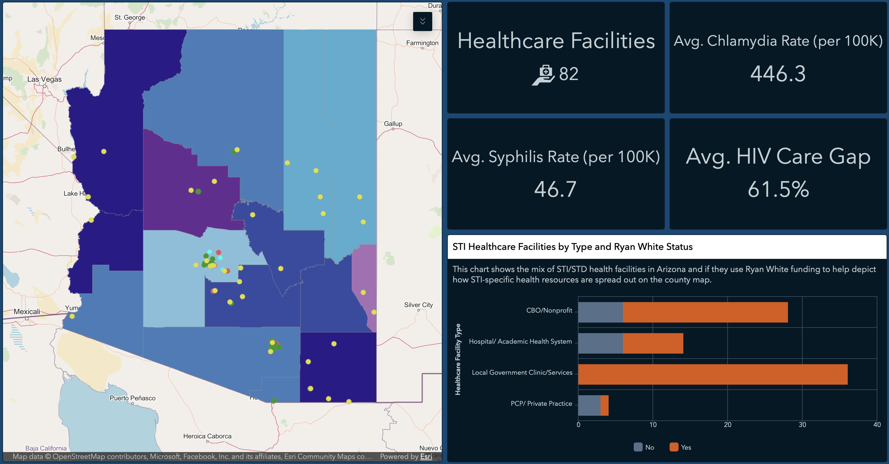
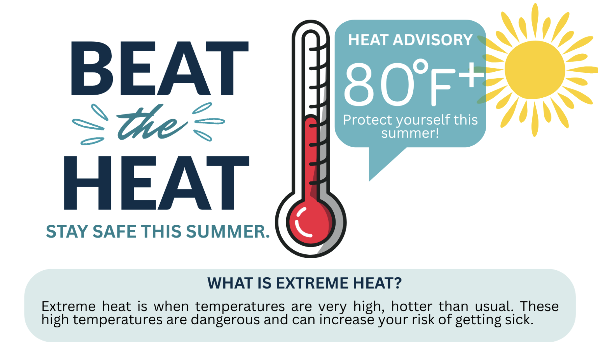
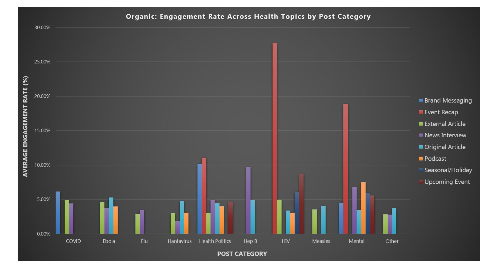
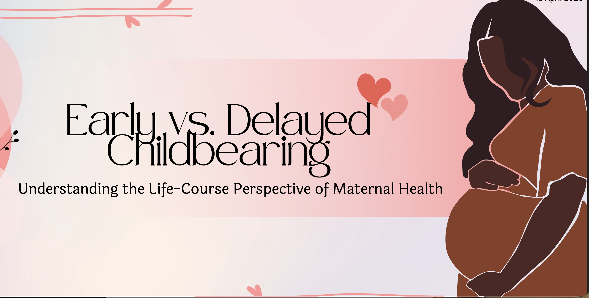
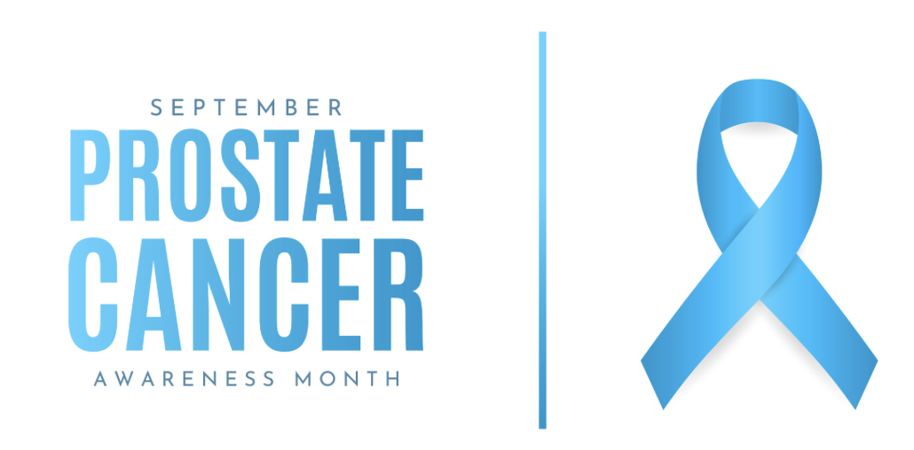
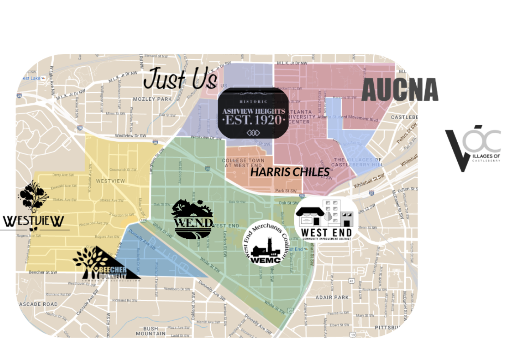
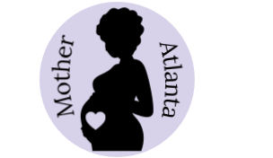
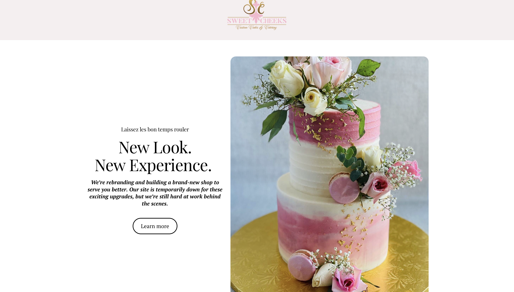
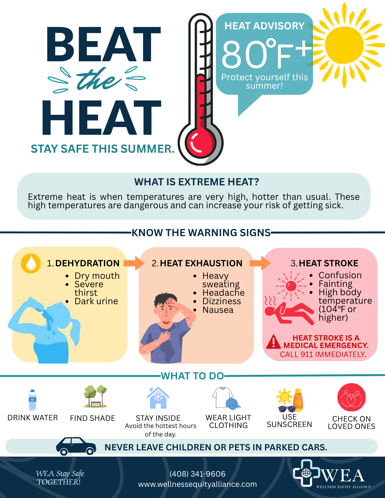
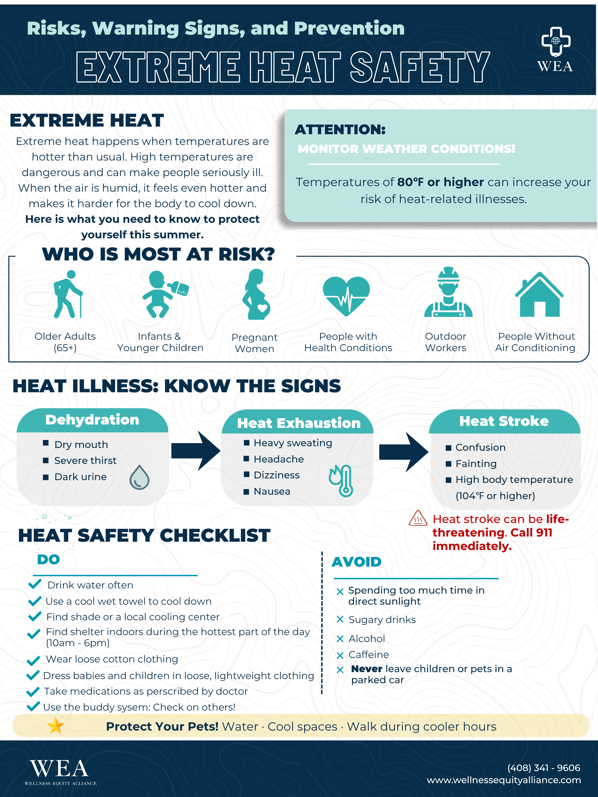

```{=html}

<!-- PROJECTS PAGE -->

<div class="projects-page">

<a href="#projects-bottom"
     class="scroll-cue"
     aria-label="Scroll to bottom of Projects and Research">
    <span class="scroll-arrow">↓</span>
  </a>

  <!-- HERO -->
  <section class="projects-hero">
    <div class="projects-hero-copy">
      <p class="projects-kicker">PROJECTS &amp; RESEARCH</p>
      <h1>From Data to Real-World Impact.</h1>
      <p class="projects-intro">
        A collection of applied projects, research, and creative work that
        translate data, community insight, and innovation into meaningful solutions.
      </p>
    </div>

  </section>


  <div class="projects-divider"></div>


  <!-- APPLIED PRACTICE EXPERIENCE -->
  <section class="projects-section">

    <div class="projects-section-heading">
      <div>
        <p class="projects-kicker">APPLIED PRACTICE EXPERIENCE</p>
        <h2>Internship</h2>
        <p class="projects-organization">
          Wellness Equity Alliance &nbsp; | &nbsp; Summer 2026
        </p>
      </div>

      <p class="projects-section-note">
        Real-world experience supporting community-centered healthcare through
        data, communication, and education.
      </p>
    </div>


    <!-- PROJECT GALLERY -->
    <div class="projects-carousel-shell">

      <button class="projects-carousel-arrow projects-carousel-arrow-left"
              type="button"
              aria-label="Scroll projects left">
        &#8249;
      </button>

      <div class="projects-carousel" id="wea-projects">


        <!-- ARIZONA STI -->
        <article class="project-card">

          <div class="project-card-image">
  
</div>

          <div class="project-card-body">

            <h3>
              Arizona STI Disease Burden &amp;<br>
              Healthcare Access Dashboard
            </h3>

            <div class="project-tags">
              <span>GIS</span>
              <span>Public Health Informatics</span>
              <span>STI Prevention</span>
            </div>

            <a
  href="https://africageoportal.maps.arcgis.com/apps/dashboards/2415865c5d1747c19141406fae4df4e3#"
  class="project-view-button">
  VIEW PROJECT <span aria-hidden="true">→</span>
</a>

          </div>
        </article>


        <!-- EXTREME HEAT -->
        <article class="project-card">

         <div class="project-card-image">
  
</div>

          <div class="project-card-body">

            <h3>Extreme Heat Health Literacy</h3>

            <div class="project-tags">
              <span>Health Education</span>
              <span>Community Outreach</span>
              <span>Preventive Health</span>
            </div>

<button
  class="project-view-button"
  type="button"
  data-project-modal="extreme-heat-modal"
>
  VIEW PROJECT <span aria-hidden="true">→</span>
</button>

          </div>
        </article>


        <!-- LINKEDIN ANALYTICS -->
        <article class="project-card">

          <div class="project-card-image">
  
</div>

          <div class="project-card-body">

            <h3>LinkedIn Communications Analytics</h3>

            <div class="project-tags">
              <span>Social Media Analytics</span>
              <span>Health Communication</span>
              <span>Strategy</span>
            </div>

            <button
  class="project-view-button"
  type="button"
  data-project-modal="linkedin-analytics-modal"
>
  VIEW PROJECT <span aria-hidden="true">→</span>
</button>

          </div>
        </article>

      </div>


      <button class="projects-carousel-arrow projects-carousel-arrow-right"
              type="button"
              aria-label="Scroll projects right">
        &#8250;
      </button>

    </div>

  </section>


  <!-- DIVIDER -->
  <div class="projects-divider projects-section-divider"></div>


  <!-- ACADEMIC RESEARCH & COURSE PROJECTS -->
  <section class="projects-section">

    <div class="projects-section-heading">
      <div>
        <p class="projects-kicker">ACADEMIC RESEARCH &amp; COURSE PROJECTS</p>
        <h2>Selected Work</h2>
        <p class="projects-organization">
          Morehouse School of Medicine
        </p>
      </div>

      <p class="projects-section-note">
        Building research, analytical, and intervention skills to address
        real-world public health challenges.
      </p>
    </div>


    <div class="projects-carousel-shell">

      <button class="projects-carousel-arrow projects-carousel-arrow-left"
              type="button"
              aria-label="Scroll academic projects left">
        &#8249;
      </button>

      <div class="projects-carousel" id="academic-projects">


        <!-- AGE AT FIRST LIVE BIRTH -->
        <article class="project-card">

          <div class="project-card-image">
  
</div>

          <div class="project-card-body">

            <h3>
              Age at First Live Birth and Socioeconomic Status Among U.S. Women
            </h3>

            <div class="project-tags">
              <span>Reproductive Health</span>
              <span>Social Determinants</span>
              <span>Quantitative Analysis</span>
            </div>

            <button
  class="project-view-button"
  type="button"
  data-project-modal="first-birth-modal"
>
  VIEW PROJECT <span aria-hidden="true">→</span>
</button>

          </div>
        </article>


        <!-- PSA TESTING -->
        <article class="project-card">

<div class="project-card-image">
  
</div>

          <div class="project-card-body">

            <h3>
              Factors Associated with PSA Testing Among U.S. Men Aged 40 and Older
            </h3>

            <div class="project-tags">
              <span>Cancer Screening</span>
              <span>Epidemiology</span>
              <span>Statistical Analysis</span>
            </div>

            <button
  class="project-view-button"
  type="button"
  data-project-modal="psa-research-modal"
>
  VIEW PROJECT <span aria-hidden="true">→</span>
</button>

          </div>
        </article>


        <!-- NPU-T COMMUNITY NEEDS ASSESSMENT -->
        <article class="project-card">

          <div class="project-card-image">
  
</div>

          <div class="project-card-body">

            <h3>
              NPU-T Community Needs Assessment &amp; Windshield Survey
            </h3>

            <div class="project-tags">
              <span>Community Health</span>
              <span>Needs Assessment</span>
              <span>Community Observation</span>
            </div>

            <a
  href="https://npuassessment.my.canva.site/npu-portfolio"
  class="project-view-button">
  VIEW PROJECT <span aria-hidden="true">→</span>
</a>

          </div>
        </article>


        <!-- NPU-T HEALTH PROMOTION INTERVENTION -->
<article class="project-card">

  <div class="project-card-image">
    
  </div>

          <div class="project-card-body">

            <h3>NPU-T Health Promotion Intervention Plan</h3>

            <p class="project-card-subtitle">
              Intervention Plan &amp; Community-Facing Website Prototype
            </p>

            <div class="project-tags">
              <span>Health Promotion</span>
              <span>Intervention Planning</span>
              <span>Web Design</span>
            </div>

            <button
  class="project-view-button"
  type="button"
  data-project-modal="nput-intervention-modal"
>
  VIEW PROJECT <span aria-hidden="true">→</span>
</button>

          </div>
        </article>

      </div>


      <button class="projects-carousel-arrow projects-carousel-arrow-right"
              type="button"
              aria-label="Scroll academic projects right">
        &#8250;
      </button>

    </div>

  </section>


  <!-- DIVIDER -->
  <div class="projects-divider projects-section-divider"></div>


  <!-- PROFESSIONAL PROJECTS -->
  <section class="projects-section projects-professional-section">

    <div class="projects-section-heading">
      <div>
        <p class="projects-kicker">PROFESSIONAL PROJECTS</p>
<h2>Selected Professional Work</h2>
      </div>

      <p class="projects-section-note">
        Applying strategic thinking, creative problem-solving, and project development across professional settings. 
      </p>
    </div>


    <!-- SWEET CHEEKS FEATURE -->
    <article class="professional-project-card">

      <div class="professional-project-visual">
  
</div>


      <div class="professional-project-content">

        <div>
          <p class="professional-project-eyebrow">
            SWEET CHEEKS CUSTOM CAKES &amp; CATERING
          </p>

          <h3>Branding &amp; Business Development</h3>

          <p class="professional-project-role">
            Freelance Branding &amp; Business Development Advisor
          </p>

          <p class="professional-project-description">
            Supported brand development, marketing strategy, and business planning efforts while translating the company's evolving vision into a cohesive digital presence.
          </p>
        </div>


        <div class="professional-project-skills">

  <div class="professional-skill">
    <span class="professional-skill-icon" aria-hidden="true">◇</span>
    <span>Strategic<br>Planning</span>
  </div>

  <div class="professional-skill">
    <span class="professional-skill-icon" aria-hidden="true">◇</span>
    <span>Communication</span>
  </div>

  <div class="professional-skill">
    <span class="professional-skill-icon" aria-hidden="true">◇</span>
    <span>Project<br>Development</span>
  </div>

  <div class="professional-skill">
    <span class="professional-skill-icon" aria-hidden="true">◇</span>
    <span>Digital<br>Design</span>
  </div>

</div>

        <a
          href="https://www.sweetcheeksccc.com"
          class="professional-view-button">
          VIEW PROJECT <span aria-hidden="true">→</span>
        </a>

<!-- =========================================================
     EXTREME HEAT HEALTH LITERACY MODAL
     ========================================================= -->

<dialog class="project-modal" id="extreme-heat-modal">

  <div class="project-modal-inner">

    <button
      type="button"
      class="project-modal-close"
      aria-label="Close project viewer">
      ×
    </button>

    <div class="project-modal-header">

      <p class="project-modal-kicker">
        WELLNESS EQUITY ALLIANCE • SUMMER 2026
      </p>

      <h2>Extreme Heat Health Literacy</h2>

    </div>


    <div class="project-modal-viewer">

      <!-- PAGE 1 -->
      <div class="project-modal-slide is-active">

        <p class="project-modal-page-label">
          Extreme Heat Basics
        </p>

        

      </div>


      <!-- PAGE 2 -->
      <div class="project-modal-slide">

        <p class="project-modal-page-label">
          Risks and Prevention of Extreme Heat
        </p>

        

      </div>

    </div>


    <div class="project-modal-controls">

      <button
        type="button"
        class="project-modal-arrow project-modal-prev"
        aria-label="Previous page">
        ←
      </button>

      <div class="project-modal-pagination">

        <button
          type="button"
          class="project-modal-dot is-active"
          aria-label="View page 1">
        </button>

        <button
          type="button"
          class="project-modal-dot"
          aria-label="View page 2">
        </button>

      </div>

      <button
        type="button"
        class="project-modal-arrow project-modal-next"
        aria-label="Next page">
        →
      </button>

    </div>


    <p class="project-modal-counter">
      <span class="project-modal-current">1</span> / 2
    </p>

  </div>

</dialog>

<!-- =========================================================
     LINKEDIN ANALYTICS MODAL
     ========================================================= -->

<dialog class="project-modal linkedin-project-modal" id="linkedin-analytics-modal">

  <div class="project-modal-inner linkedin-modal-inner">

    <button
      type="button"
      class="project-modal-close"
      aria-label="Close LinkedIn Analytics project viewer">
      ×
    </button>

    <div class="project-modal-header">

      <p class="project-modal-kicker">
        WELLNESS EQUITY ALLIANCE • 2025–2026
      </p>

      <h2>LinkedIn Communications Analytics</h2>

      <p class="linkedin-modal-label">
        SELECTED PRESENTATION HIGHLIGHTS
      </p>

    </div>


    <div class="linkedin-pdf-viewer">

      <iframe
        src="files/LinkedIn-Analytics-Revised.pdf#toolbar=0&navpanes=0&scrollbar=1"
        title="Selected presentation highlights from the LinkedIn Communications Analytics project">
      </iframe>

    </div>

  </div>

</dialog>

<!-- =========================================================
     AGE AT FIRST LIVE BIRTH R PROJECT MODAL
     ========================================================= -->

<dialog class="project-modal r-project-modal" id="first-birth-modal">

  <div class="project-modal-inner r-project-modal-inner">

    <button
      type="button"
      class="project-modal-close"
      aria-label="Close Age at First Live Birth project viewer">
      ×
    </button>

    <div class="project-modal-header r-project-modal-header">

      <p class="project-modal-kicker">
        MOREHOUSE SCHOOL OF MEDICINE • R PROJECT
      </p>

      <h2>
        Age at First Live Birth and Socioeconomic Status Among U.S. Women
      </h2>

      <p class="r-project-modal-label">
        RENDERED RESEARCH REPORT
      </p>

      <a
        href="https://github.com/knewton910/Project4"
        class="r-project-github-button">
        VIEW R CODE ON GITHUB <span aria-hidden="true">→</span>
      </a>

    </div>


    <div class="r-project-pdf-viewer">

      <iframe
        src="files/R-MCH-Project-4.pdf#toolbar=0&navpanes=0&scrollbar=1"
        title="Rendered research report for Age at First Live Birth and Socioeconomic Status Among U.S. Women">
      </iframe>

    </div>

  </div>

</dialog>


<!-- =========================================================
     PSA TESTING RESEARCH PROPOSAL MODAL
     ========================================================= -->

<dialog class="project-modal psa-project-modal" id="psa-research-modal">

  <div class="project-modal-inner psa-project-modal-inner">

    <button
      type="button"
      class="project-modal-close"
      aria-label="Close PSA Testing research proposal viewer">
      ×
    </button>

    <div class="project-modal-header psa-project-modal-header">

      <p class="project-modal-kicker">
        MOREHOUSE SCHOOL OF MEDICINE • RESEARCH PROPOSAL
      </p>

      <h2>
        Factors Associated with PSA Testing Among U.S. Men Aged 40 and Older
      </h2>

      <p class="psa-project-modal-label">
        RESEARCH PROPOSAL
      </p>

    </div>


    <div class="psa-project-pdf-viewer">

      <iframe
        src="files/pc-research-proposal.pdf#toolbar=0&navpanes=0&scrollbar=1"
        title="Research proposal examining factors associated with PSA testing among U.S. men aged 40 and older">
      </iframe>

    </div>

  </div>

</dialog>


<!-- =========================================================
     NPU-T HEALTH PROMOTION INTERVENTION MODAL
     ========================================================= -->

<dialog
  class="project-modal nput-intervention-modal"
  id="nput-intervention-modal"
>

  <div class="project-modal-inner nput-intervention-modal-inner">

    <button
      type="button"
      class="project-modal-close"
      aria-label="Close NPU-T Health Promotion Intervention project viewer">
      ×
    </button>

    <div class="project-modal-header nput-intervention-modal-header">

      <p class="project-modal-kicker">
        MOREHOUSE SCHOOL OF MEDICINE • HEALTH PROMOTION INTERVENTION
      </p>

      <h2>
        NPU-T Health Promotion Intervention Plan
      </h2>

      <p class="nput-intervention-modal-label">
        INTERVENTION PLAN &amp; COMMUNITY-FACING WEBSITE
      </p>

      <a
        href="https://npuassessment.my.canva.site/sep/amhc--mother-atlanta"
        class="nput-intervention-site-button">
        VIEW MOTHER ATLANTA WEBSITE <span aria-hidden="true">→</span>
      </a>

    </div>


    <div class="nput-intervention-pdf-viewer">

      <iframe
        src="files/NPUT-intervention-plan.pdf#toolbar=0&navpanes=0&scrollbar=1"
        title="NPU-T Health Promotion Intervention Plan">
      </iframe>

    </div>

  </div>

</dialog>

<div id="projects-bottom"></div>
```


```{=html}
<script>
document.addEventListener("DOMContentLoaded", function () {

  function setupCarousel(carouselId) {
    const carousel = document.getElementById(carouselId);

    if (!carousel) return;

    const shell = carousel.closest(".projects-carousel-shell");
    const leftArrow = shell.querySelector(".projects-carousel-arrow-left");
    const rightArrow = shell.querySelector(".projects-carousel-arrow-right");

    if (!leftArrow || !rightArrow) return;

    function getScrollAmount() {
      const firstCard = carousel.querySelector(".project-card");

      if (!firstCard) return carousel.clientWidth;

      const styles = window.getComputedStyle(carousel);
      const gap = parseFloat(styles.columnGap || styles.gap) || 0;

      return firstCard.getBoundingClientRect().width + gap;
    }

    function updateArrows() {
      const maxScrollLeft = carousel.scrollWidth - carousel.clientWidth;
      const tolerance = 5;

      /* Nothing to scroll: hide both arrows */
      if (maxScrollLeft <= tolerance) {
        leftArrow.style.visibility = "hidden";
        rightArrow.style.visibility = "hidden";
        leftArrow.disabled = true;
        rightArrow.disabled = true;
        return;
      }

      /* Carousel can scroll */
      leftArrow.style.visibility = "visible";
      rightArrow.style.visibility = "visible";

      /* Beginning of carousel */
      if (carousel.scrollLeft <= tolerance) {
        leftArrow.style.visibility = "hidden";
        leftArrow.disabled = true;
      } else {
        leftArrow.style.visibility = "visible";
        leftArrow.disabled = false;
      }

      /* End of carousel */
      if (carousel.scrollLeft >= maxScrollLeft - tolerance) {
        rightArrow.style.visibility = "hidden";
        rightArrow.disabled = true;
      } else {
        rightArrow.style.visibility = "visible";
        rightArrow.disabled = false;
      }
    }

    leftArrow.addEventListener("click", function () {
      carousel.scrollBy({
        left: -getScrollAmount(),
        behavior: "smooth"
      });
    });

    rightArrow.addEventListener("click", function () {
      carousel.scrollBy({
        left: getScrollAmount(),
        behavior: "smooth"
      });
    });

    carousel.addEventListener("scroll", updateArrows);

    window.addEventListener("resize", updateArrows);

    /* Check arrow state when page first loads */
    requestAnimationFrame(updateArrows);
  }

  setupCarousel("wea-projects");
  setupCarousel("academic-projects");

  /* =========================================================
     PROJECT MODAL VIEWER
     ========================================================= */

  const modalTriggers = document.querySelectorAll("[data-project-modal]");

  modalTriggers.forEach(function (trigger) {

    trigger.addEventListener("click", function () {

      const modalId = trigger.dataset.projectModal;
      const modal = document.getElementById(modalId);

      if (!modal) return;

      modal.showModal();

    });

  });


  document.querySelectorAll(".project-modal").forEach(function (modal) {

    const closeButton = modal.querySelector(".project-modal-close");
    const slides = Array.from(
      modal.querySelectorAll(".project-modal-slide")
    );
    const dots = Array.from(
      modal.querySelectorAll(".project-modal-dot")
    );
    const previousButton = modal.querySelector(".project-modal-prev");
    const nextButton = modal.querySelector(".project-modal-next");
    const counter = modal.querySelector(".project-modal-current");

    let currentSlide = 0;


    function showSlide(index) {

      if (!slides.length) return;

      if (index < 0) {
        index = slides.length - 1;
      }

      if (index >= slides.length) {
        index = 0;
      }

      currentSlide = index;


      slides.forEach(function (slide, slideIndex) {

        slide.classList.toggle(
          "is-active",
          slideIndex === currentSlide
        );

      });


      dots.forEach(function (dot, dotIndex) {

        dot.classList.toggle(
          "is-active",
          dotIndex === currentSlide
        );

      });


      if (counter) {
        counter.textContent = currentSlide + 1;
      }

    }


    if (closeButton) {

      closeButton.addEventListener("click", function () {
        modal.close();
      });

    }


    if (previousButton) {

      previousButton.addEventListener("click", function () {
        showSlide(currentSlide - 1);
      });

    }


    if (nextButton) {

      nextButton.addEventListener("click", function () {
        showSlide(currentSlide + 1);
      });

    }


    dots.forEach(function (dot, index) {

      dot.addEventListener("click", function () {
        showSlide(index);
      });

    });


    /* Close when clicking outside the modal panel */

    modal.addEventListener("click", function (event) {

      const rect = modal.getBoundingClientRect();

      const clickedInside =
        event.clientX >= rect.left &&
        event.clientX <= rect.right &&
        event.clientY >= rect.top &&
        event.clientY <= rect.bottom;

      if (!clickedInside) {
        modal.close();
      }

    });


    /* Reset viewer to page 1 whenever it closes */

    modal.addEventListener("close", function () {
      showSlide(0);
    });


    showSlide(0);

  });

});
</script>